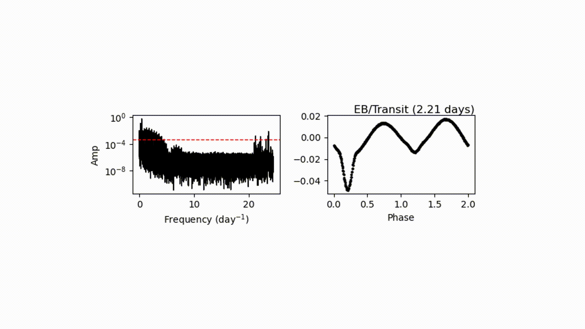

.. Deep-LC documentation master file, created by
   sphinx-quickstart on Thu Nov  9 20:38:33 2023.
   You can adapt this file completely to your liking, but it should at least
   contain the root `toctree` directive.

Welcome to Deep-LC's documentation!
===================================

``Deep-LC``  is open-source and intended for the classification of light curves (LCs) in a gernaral purpose. It utilizes a weakly supervised object detection algorithm to automatically zoom in on the LC and power spectrum (PS) to extract local features. This eliminates the need for manual feature extraction and allows it to be applied to both space- and ground-based observations, as well as multiband LCs with large gaps and nonuniform sampling.

It can zooms in a light curve automatically and output intermediate predictions

.. image:: lc.gif
   :width: 66%
   :align: center

Same as light curve, it can automatically look for the significant peak and fold the light curve to make the class predictions.

.. toctree::
   :maxdepth: 2
   :caption: Contents:

   notebooks/Quickstart.ipynb
   notebooks/Finetuning.ipynb
   api_ref.rst

Indices and tables
==================

* :ref:`genindex`
* :ref:`modindex`
* :ref:`search`
